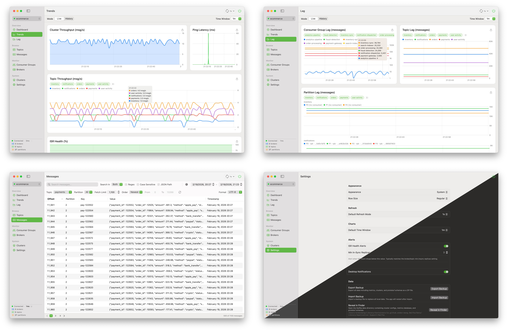

<b><font>Swifka</font></b>

A native macOS Kafka monitor. Read-only by design.

<br clear="all" />

<p align="center">
  <b>⚠️ Swifka is currently under active development. We are aiming for a 1.0 stable release.</b>
</p>

<p align="center">
  <a href="https://github.com/Ender-Wang/Swifka/releases"></a>
  <a href="https://github.com/Ender-Wang/Swifka/releases"></a>
  <br />
  
  
  <a href="LICENSE"></a>
</p>

**Why Swifka exists:** Every existing Kafka client is either Java-based (Offset Explorer, Conduktor) or web-based (AKHQ, Kafdrop, Redpanda Console) — and every single one of them tries to be a full Kafka Swiss Army knife. None of them feel at home on macOS, and none of them nail "lightweight, safe, read-only monitoring."

<div align="center">

| Tool | Stack | Problem |
|------|-------|---------|
| Offset Explorer | Java (Swing) | Feature-rich but bloated and dated |
| Conduktor | Java (JavaFX) | Pivoted to SaaS, heavy |
| AKHQ / Kafdrop | Java (Web) | Requires deployment, full admin scope |
| Redpanda Console | Go + React (Web) | Web-based, full admin capabilities |
| kcat | CLI | Powerful but raw |

</div>

Swifka fills the gap: a native macOS client built for **monitoring only** — safe to point at production, with zero risk of accidental writes. The teams that adopt Swifka are the ones that want a tool they can hand to any engineer, including junior developers and on-call rotations, without worrying about accidental production damage.

<p align="center">
  
</p>

# Features

**Cluster & Connection**

- Connect to any Kafka-compatible cluster (Kafka, Redpanda, etc.)
- Multi-cluster management with pin, clone, drag-to-reorder, and keyboard navigation
- Cluster backup & restore (timestamped `.zip` export/import)
- Keychain-secured credentials

**Topics & Messages**

- Browse topics, partitions, and messages with detailed metadata
- Message decoding: UTF-8, Hex, Base64, Protobuf (import `.proto` files), JSON pretty-print
- Search messages by keyword, regex, or JSON path (e.g., `user.email:john@`) with time range filter

**Monitoring & Charts**

- Consumer group lag monitoring with per-partition breakdown
- Real-time trend charts: throughput, lag, ISR health (Live & History modes)
- Per-consumer member lag investigation
- Broker health dashboard with leader distribution
- SQL-downsampled historical data with configurable retention

**Alerts & Notifications**

- ISR health alerts (under-replicated, critical, below min.insync.replicas)
- macOS desktop notifications

**Quality of Life**

- Menu bar resident mode
- Excel (.xlsx) chart data export
- Manual + timed refresh (5s / 10s / 30s / 60s) with circuit breaker
- Dark mode, compact/regular/large row density
- English + Simplified Chinese (JSON-based, easy to contribute)
- Read-only by design — zero risk of accidental writes to production

# Install

```bash
brew install --cask ender-wang/tap/swifka
```

Or download the latest `.dmg` from [Releases](https://github.com/Ender-Wang/Swifka/releases).

---

# Roadmap

## Milestone 1: MVP Core

✨ **Features**

- [x] Cluster connection management (add/edit/delete, multi-cluster switching, test connection)
- [x] Topic list with partition detail (replicas, leader, ISR, watermarks)
- [x] Message browsing (key, value, timestamp, offset) with UTF-8 / Hex / Base64 display
- [x] Consumer group list with lag display (watermark-based)
- [x] Broker list and basic stats (topic count, partition count)

⚙️ **Settings & Infrastructure**

- [x] Config persistence (JSON) + Keychain for credentials
- [x] Manual + timed refresh (5s / 10s / 30s / 60s)
- [x] Read-only by default, extension points for future write features

🌍 **i18n**

- [x] i18n framework — English + Simplified Chinese (JSON-based, easy to contribute)

## Milestone 2: Dashboards & Visualization

📊 **Features**

- [x] Cluster health overview with production/consumption throughput
- [x] Per-topic lag ranking and total lag display
- [x] Per-partition lag breakdown in consumer group detail panel
- [x] Swift Charts — lag trends, throughput trends
- [x] Per-consumer member lag chart (aggregate partition lag per consumer instance)

🔧 **Enhancements**

- [x] Local database storage (SQLite ~~/ SwiftData~~) with configurable retention
- [x] Historical data browsing with date range filtering and scrollable charts
- [x] Hover-to-inspect tooltips on trend charts with color markers and value ranking
- [x] SQL aggregation + extended time ranges for History mode (1h / 6h / 24h / 7d)
- [x] Paginated message browsing (500 per page)

⚠️ **Health & Alerts**

- [x] ISR health monitoring and alerts
  - [x] Alert: Under-replicated partitions (ISR < replication factor)
  - [x] Alert: Critical ISR level (ISR = 1, single point of failure)
  - [x] Alert: ISR below min.insync.replicas (partition at risk)
  - [x] ISR history graph (track ISR changes over time)
- [x] Desktop notifications (macOS native alerts)

## Milestone 3: Animations & Polish

📊 **Advanced Charts**

- [x] ~~Trends page tab reorganization~~ → Split into Trends (cluster health) + Lag (consumer investigation) pages
- [x] ~~Pinch-to-zoom on History charts for time range drill-down~~ — visible window picker (1m–7d) provides equivalent zoom
- [x] ~~Chart statistics overlay (avg / min / max per series in visible window)~~ — superseded by global Mean/Min/Max aggregation mode
- [x] ~~Timeline gap compression~~ — deferred; data smoothing is a better alternative
- [x] ~~Data smoothing for large time windows~~ — covered by Mean/Min/Max SQL downsampling
- [x] ~~Export chart data as CSV~~ → replaced with Excel (.xlsx) export with per-series sheets

🎨 **UI & Animations**

- [x] Animated line drawing for chart transitions
- [x] ~~Message flow animations and real-time data change effects~~ — per-point interpolation conflicts with SwiftUI Charts' y-axis auto-ranging, causing visual glitches; not worth the complexity
- [x] Trends page loading/mode-switch transitions (Live ↔ History)
- [x] Dark mode optimization
- [x] Broker health dashboard (leader distribution chart + stats cards)

🔧 **Enhancements**

- [x] Menu bar resident mode + keyboard shortcuts
- [x] Cluster manager enhancements
  - [x] Pin favorite clusters to top
  - [x] Clone/duplicate cluster configs (with password copy)
  - [x] Export/import clusters with selective backup (timestamped files)
  - [x] Multiple sort modes (manual, name, last connected, created, modified)
  - [x] Drag-to-reorder and drag-to-pin/unpin
  - [x] Track last connected timestamp for each cluster
  - [x] Keyboard navigation (↑↓ arrows, Enter to connect, shortcuts for test/edit/delete/clone)

## Milestone 4: Advanced Monitoring & Search

✨ **Features**

- [x] Message deserialization
  - [x] Extensible deserializer protocol with per-topic format memory
  - [x] Protobuf decoding (import .proto files, schema-aware field names, nested messages)
  - [x] ~~Avro deserialization~~ — deferred (future work)
  - [x] ~~Application-level decryption~~ — deferred (future work)
  - [x] ~~Custom deserializers (plugin system)~~ — deferred (future work)
- [x] JSON pretty-printing with syntax highlighting
- [x] Message search/filter
  - [x] Search by key, value, or both
  - [x] Time range filter
  - [x] Keyword and regex search
  - [x] JSON path search (e.g., `user.email:john@`)

📊 **Monitoring**

- [x] Broker liveness monitoring, consumer activity status

## Milestone 5: Release Polish & Extended Monitoring

- [x] ~~Send test messages, create/delete topics, reset offsets~~ — write operations contradict Swifka's core identity as a safe, read-only monitor; in production environments, topic management belongs in IaC (Terraform), offset resets in audited CLI runbooks, and message production in application code
- [x] ~~Permission tiers (Read / Write / Admin / Dangerous)~~ — unnecessary without write operations
- [x] ~~Docker API integration for local dev environments~~ — users manage Docker externally
- [x] ~~Failure simulation and recovery monitoring~~ — chaos engineering, not monitoring; out of scope

🔍 **Extended Monitoring**

- [x] Schema Registry integration (read-only, Confluent-compatible)
- [x] Avro deserialization support
- [ ] Configurable alert rules (lag thresholds, broker liveness)
- [ ] Structured logging (os.Logger + Console.app)

🎨 **Polish**

- [ ] Accessibility (VoiceOver, keyboard-only workflows)

📦 **Release**

- [ ] Logo, screenshots, full README, CONTRIBUTING.md, GitHub Releases

---

# Contributing

**Requirements:** macOS 15.7+, Xcode 16.2+, [Homebrew](https://brew.sh)

```bash
brew install swiftformat
```

Code style is enforced by [SwiftFormat](https://github.com/nicklockwood/SwiftFormat) via a build phase — rules are in `.swiftformat` at the project root.

---

# Localization

Swifka uses a custom JSON-based i18n system. Currently supported:

| Language | File | Status |
|----------|------|--------|
| English | `Resources/Locales/en.json` | Complete |
| Simplified Chinese | `Resources/Locales/zh-Hans.json` | Complete |

## Contributing a Translation

1. Copy `Resources/Locales/en.json`
2. Rename to your language code (e.g. `ja.json`, `ko.json`, `fr.json`, `de.json`)
3. Translate the values (keep the keys as-is)
4. Submit a PR

No code changes needed — the app picks up new locale files automatically.

---

# Star History

<a href="https://star-history.com/#Ender-Wang/Swifka&Date">
 <picture>
   <source media="(prefers-color-scheme: dark)" srcset="https://api.star-history.com/svg?repos=Ender-Wang/Swifka&type=Date&theme=dark" />
   <source media="(prefers-color-scheme: light)" srcset="https://api.star-history.com/svg?repos=Ender-Wang/Swifka&type=Date" />
   
 </picture>
</a>

---

# License

Swifka is licensed under the [GNU General Public License v3.0](LICENSE).

# Acknowledgments

Swifka is built on top of these open-source projects:

| Project | License | Description |
|---------|---------|-------------|
| [swift-kafka-client](https://github.com/swift-server/swift-kafka-client) | Apache-2.0 | SSWG-maintained Swift Kafka client |
| [librdkafka](https://github.com/confluentinc/librdkafka) | BSD-2-Clause | C library for Kafka protocol, used directly for metadata and watermark APIs |
| [SQLite.swift](https://github.com/stephencelis/SQLite.swift) | MIT | Type-safe SQLite wrapper for metrics storage |
| [SwiftProtobuf](https://github.com/apple/swift-protobuf) | Apache-2.0 | Protocol Buffers runtime for message decoding |
| [SwiftFormat](https://github.com/nicklockwood/SwiftFormat) | MIT | Code formatting tool used in the build pipeline |
