<b><font>Swifka</font></b>

A native macOS Kafka monitor. Read-only by design.

<br clear="all" />

<p align="center">
  <b>⚠️ Swifka is currently under active development. We are aiming for a 1.0 stable release.</b>
</p>

<p align="center">
  <a href="https://github.com/Ender-Wang/Swifka/releases"></a>
  <a href="https://github.com/Ender-Wang/Swifka/releases"></a>
  <br />
  
  
  <a href="LICENSE"></a>
</p>

**Why Swifka exists:** Every existing Kafka client is either Java-based (Offset Explorer, Conduktor) or web-based (AKHQ, Kafdrop, Redpanda Console) — and every single one of them tries to be a full Kafka Swiss Army knife. None of them feel at home on macOS, and none of them nail "lightweight, safe, read-only monitoring."

<div align="center">

| Tool | Stack | Problem |
|------|-------|---------|
| Offset Explorer | Java (Swing) | Feature-rich but bloated and dated |
| Conduktor | Java (JavaFX) | Pivoted to SaaS, heavy |
| AKHQ / Kafdrop | Java (Web) | Requires deployment, full admin scope |
| Redpanda Console | Go + React (Web) | Web-based, full admin capabilities |
| kcat | CLI | Powerful but raw |

</div>

Swifka fills the gap: a native macOS client built for **monitoring only** — safe to point at production, with zero risk of accidental writes. The teams that adopt Swifka are the ones that want a tool they can hand to any engineer, including junior developers and on-call rotations, without worrying about accidental production damage.

<p align="center">
  
</p>

# Features

**Cluster & Connection**

- Connect to any Kafka-compatible cluster (Kafka, Redpanda, etc.)
- Multi-cluster management with pin, clone, drag-to-reorder, and keyboard navigation
- Cluster backup & restore (timestamped `.zip` export/import)
- Keychain-secured credentials

**Topics & Messages**

- Browse topics, partitions, and messages with detailed metadata
- Message decoding: UTF-8, Hex, Base64, Protobuf (import `.proto` files), Avro, JSON pretty-print
- Schema Registry integration — auto-decode Confluent wire format messages (Protobuf, Avro, JSON)
- Search messages by keyword, regex, or JSON path (e.g., `user.email:john@`) with time range filter

**Monitoring & Charts**

- Consumer group lag monitoring with per-partition breakdown
- Real-time trend charts: throughput, lag, ISR health (Live & History modes)
- Per-consumer member lag investigation
- Broker health dashboard with leader distribution
- SQL-downsampled historical data with configurable retention

**Alerts & Notifications**

- Configurable alert rules: ISR health, cluster lag, broker latency, broker offline
- Alert history with resolution tracking and detail panel
- macOS desktop notifications

**Quality of Life**

- Menu bar resident mode
- Excel (.xlsx) chart data export
- Manual + timed refresh (5s / 10s / 30s / 60s) with circuit breaker
- Dark mode, compact/regular/large row density
- English + Simplified Chinese (JSON-based, easy to contribute)
- Read-only by design — zero risk of accidental writes to production

# Install

```bash
brew install --cask ender-wang/tap/swifka
```

Or download the latest `.dmg` from [Releases](https://github.com/Ender-Wang/Swifka/releases).

---

# Roadmap

| Milestone | Focus | Status |
|-----------|-------|--------|
| 1 | MVP Core — connections, topics, messages, consumer groups, brokers | ✅ |
| 2 | Dashboards & Visualization — charts, alerts, historical data, SQLite | ✅ |
| 3 | Animations & Polish — chart animations, cluster manager, menu bar | ✅ |
| 4 | Advanced Monitoring & Search — Protobuf/Avro decode, regex/JSON path search | ✅ |
| 5 | Release Polish — Schema Registry, alert rules, accessibility, logging, in-app auto-update → **1.0.0** | 🚧 |

<details>
<summary>Detailed milestone breakdown</summary>

**Milestone 1: MVP Core**

- Cluster connection management (add/edit/delete, multi-cluster, test, Keychain credentials)
- Topic list with partition detail (replicas, leader, ISR, watermarks)
- Message browsing (key, value, timestamp, offset) with UTF-8 / Hex / Base64
- Consumer group list with lag display (watermark-based)
- Broker list and basic stats
- Manual + timed refresh (5s / 10s / 30s / 60s)
- i18n — English + Simplified Chinese

**Milestone 2: Dashboards & Visualization**

- Cluster health overview with throughput (msg/s)
- Per-topic and per-partition lag breakdown
- Swift Charts — lag trends, throughput trends, per-consumer member lag
- SQLite storage with configurable retention and SQL-downsampled history (1h–7d)
- Hover-to-inspect chart tooltips with color markers
- Paginated message browsing (500 per page)
- ISR health monitoring and alerts (under-replicated, critical, below min.insync.replicas)
- Desktop notifications

**Milestone 3: Animations & Polish**

- Animated line drawing for chart transitions
- Live ↔ History mode transitions
- Dark mode optimization
- Broker health dashboard (leader distribution chart + stats cards)
- Excel (.xlsx) chart data export
- Menu bar resident mode + keyboard shortcuts
- Cluster manager: pin, clone, export/import, drag-to-reorder, sort modes, keyboard navigation

**Milestone 4: Advanced Monitoring & Search**

- Message deserialization: Protobuf (.proto import), Avro (Schema Registry), JSON pretty-print
- Message search: keyword, regex, JSON path (`user.email:john@`), time range filter
- Broker liveness monitoring, consumer activity status

**Milestone 5: Release Polish & Extended Monitoring**

- Schema Registry integration (read-only, Confluent-compatible, auto-decode wire format)
- Configurable alert rules (lag, latency, broker offline) with history and resolution tracking
- Structured logging (os.Logger + Console.app)
- VoiceOver accessibility
- Logo, screenshots, GitHub Releases
- In-app auto-update (check, download, verify, install, restart) — no Sparkle dependency

</details>

---

# Contributing

**Requirements:** macOS 15.7+, Xcode 16.2+, [Homebrew](https://brew.sh)

```bash
brew install swiftformat
```

Code style is enforced by [SwiftFormat](https://github.com/nicklockwood/SwiftFormat) via a build phase — rules are in `.swiftformat` at the project root.

## Architecture

### Data Flow

```mermaid
graph TD
    V["SwiftUI Views"] -->|"observe"| A["AppState (@Observable)"]
    A -->|"user actions"| V
    R["RefreshManager"] -->|"periodic fetch"| A
    A -->|"async calls"| K["KafkaService (actor)"]
    K -->|"C FFI · librdkafka"| C["Kafka / Redpanda"]
    A -->|"decode"| D["MessageDeserializer"]
    D -.->|"schema lookup"| S["SchemaRegistryClient"]
    S -->|"HTTP"| SR["Schema Registry"]
    A <-->|"metrics"| DB[("SQLite")]
    A <-->|"configs"| CS["JSON + Keychain"]
```



### Source Tree

```
Swifka/
├── App/                            # Entry point + global state
│   ├── SwifkaApp.swift             #   @main, window groups, menu commands
│   └── AppState.swift              #   @Observable — single source of truth for all UI
├── ContentView.swift               # NavigationSplitView shell (sidebar → detail router)
│
├── Core/                           # Business logic — no SwiftUI imports
│   ├── Kafka/
│   │   ├── KafkaService.swift      #   actor — librdkafka C FFI (metadata, consume, watermarks)
│   │   ├── Models.swift            #   TopicInfo, BrokerInfo, ConsumerGroupInfo, etc.
│   │   ├── MetricStore.swift       #   In-memory snapshots for live trend charts
│   │   └── MetricModels.swift      #   MetricSnapshot, LagSnapshot value types
│   ├── Deserialization/
│   │   ├── MessageDeserializer.swift      # Format router (UTF-8, Hex, Base64, Proto, Avro, JSON)
│   │   ├── ProtobufDeserializer.swift     # .proto file import + wire-format decode
│   │   └── AvroDecoder.swift              # Avro binary decoder (all types)
│   ├── SchemaRegistry/
│   │   ├── SchemaRegistryClient.swift     # HTTP — subjects, versions, schema fetch
│   │   └── ConfluentWireFormat.swift      # Magic byte 0x00 + 4-byte schema ID extraction
│   ├── Storage/
│   │   ├── ConfigStore.swift       #   Cluster configs persisted as JSON files
│   │   ├── MetricDatabase.swift    #   SQLite — historical metrics, alerts, retention
│   │   └── BackupManager.swift     #   Cluster export/import (.zip archives)
│   └── Security/
│       └── KeychainManager.swift   #   macOS Keychain for passwords and SASL credentials
│
├── Features/                       # One directory per sidebar page
│   ├── Clusters/                   #   Cluster list — add, edit, pin, clone, connect
│   ├── Connection/                 #   Dashboard overview + cluster picker
│   ├── Topics/                     #   Topic list with expandable partition detail
│   ├── Messages/                   #   Message browser — search, filter, decode
│   ├── Monitor/                    #   Consumer groups table + broker health cards
│   ├── Trends/                     #   Throughput, ISR, ping charts (Live + History)
│   ├── Lag/                        #   Consumer lag investigation (group/topic/partition/member)
│   ├── SchemaRegistry/             #   Schema browser — subjects, versions, schema viewer
│   └── Settings/                   #   Preferences — refresh, density, language, alerts
│
├── Shared/
│   ├── Components/                 # Reusable views — MenuBarView, ConnectionStatusBadge
│   └── Utils/                      # L10n, RefreshManager, Log, ChartExporter, XLSXWriter
│
└── Resources/
    └── Locales/                    # en.json, zh-Hans.json (custom JSON-based i18n)
```

### Key Patterns

| Pattern | Detail |
|---------|--------|
| **Actor isolation** | `KafkaService` is a Swift `actor`. Blocking librdkafka C calls run on a dedicated `DispatchQueue` via `withCheckedThrowingContinuation`, keeping the actor executor free for cancellation |
| **@Observable** | `AppState` uses the `@Observable` macro. Views read properties directly — no `@Published` or `objectWillChange` needed |
| **MainActor by default** | Project sets `SWIFT_DEFAULT_ACTOR_ISOLATION = MainActor`. All types are `@MainActor` unless explicitly opted out (`KafkaService`, model structs) |
| **Read-only** | `KafkaService` only exposes read methods — no produce, delete, or admin operations exist in the codebase |
| **JSON i18n** | `L10n` loads locale JSON at runtime. Access: `l10n["key"]` or `l10n.t("key", arg1, arg2)` for interpolation |

---

# Localization

Swifka uses a custom JSON-based i18n system. Currently supported:

| Language | File | Status |
|----------|------|--------|
| English | `Resources/Locales/en.json` | Complete |
| Simplified Chinese | `Resources/Locales/zh-Hans.json` | Complete |

## Contributing a Translation

1. Copy `Resources/Locales/en.json`
2. Rename to your language code (e.g. `ja.json`, `ko.json`, `fr.json`, `de.json`)
3. Translate the values (keep the keys as-is)
4. Submit a PR

No code changes needed — the app picks up new locale files automatically.

---

# Star History

<a href="https://star-history.com/#Ender-Wang/Swifka&Date">
 <picture>
   <source media="(prefers-color-scheme: dark)" srcset="https://api.star-history.com/svg?repos=Ender-Wang/Swifka&type=Date&theme=dark" />
   <source media="(prefers-color-scheme: light)" srcset="https://api.star-history.com/svg?repos=Ender-Wang/Swifka&type=Date" />
   
 </picture>
</a>

---

# License

Swifka is licensed under the [GNU General Public License v3.0](LICENSE).

# Acknowledgments

Swifka is built on top of these open-source projects:

| Project | License | Description |
|---------|---------|-------------|
| [swift-kafka-client](https://github.com/swift-server/swift-kafka-client) | Apache-2.0 | SSWG-maintained Swift Kafka client |
| [librdkafka](https://github.com/confluentinc/librdkafka) | BSD-2-Clause | C library for Kafka protocol, used directly for metadata and watermark APIs |
| [SQLite.swift](https://github.com/stephencelis/SQLite.swift) | MIT | Type-safe SQLite wrapper for metrics storage |
| [SwiftProtobuf](https://github.com/apple/swift-protobuf) | Apache-2.0 | Protocol Buffers runtime for message decoding |
| [SwiftFormat](https://github.com/nicklockwood/SwiftFormat) | MIT | Code formatting tool used in the build pipeline |
